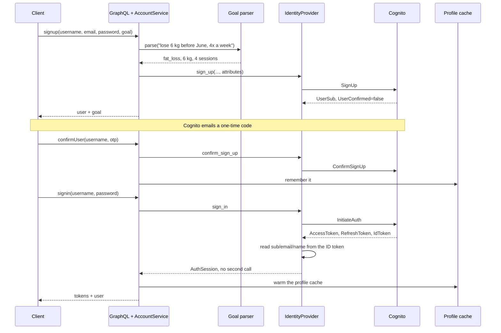

# AlterCall Fitness — identity service

Sign-up, email OTP confirmation and sign-in for the AlterCall coaching platform,
over one GraphQL endpoint. It owns no user table: accounts live in a directory
behind an interface, so the same service runs against an AWS Cognito user pool in
production and against an in-process directory on a laptop with no AWS account.
Sign-up also takes the member's goal as free text and stores the structured form.

## The whole surface

```
mutation signup(username, name, password, email, goal)  ->  user + parsed goal
mutation confirmUser(username, otp)                     ->  success + user
mutation signin(username, password)                     ->  tokens + user
query    getUser(u) / previewGoal(text) / authProvider  ->  cached profile, goal, adapter
GET      /healthz                                       ->  200 ok / 503 degraded
```

Both `/graphql` and `/graphql/` are routed, so a proxy that normalises the
trailing slash does not get a 404 from an otherwise healthy service.

The interesting argument is `goal`. Passing `"Run a half marathon in 12 weeks,
three sessions a week"` to `signup` returns `{"goalType": "endurance", "target":
null, "timeframe": "12 weeks", "sessionsPerWeek": 3, "source": "rules"}` —
`source` being `"rules"` or `"claude"`, so a client only says "AI-assisted" when
a model ran.

`signin` also still returns flat `userId` / `userName` / `userEmail` beside the
structured `user`, which is not an oversight: the sibling `altercall-frontend`
repo (package `altercall-web`) is an Apollo client for this service and its
`SIGNIN_MUTATION` selects exactly those three, so they carry a graphene
`deprecation_reason` instead of being removed.

## What it looks like running

`graphene-django` serves GraphiQL at `/graphql`, and that in-browser IDE is the
only UI this repo has. Each shot is a real query against a local server seeded by
`manage.py seed_demo`, at 1440x900 on a retina display. The same flows as `curl`
pairs are in [`docs/api-transcript.txt`](docs/api-transcript.txt).

| A structured member profile | Sign-up with goal parsing |
| --- | --- |
|  |  |
| **Sign-in returns tokens and the profile together** | **A failure carrying a stable code** |
|  |  |

The last shot is worth dwelling on. Every failure is an `IdentityError` subclass
carrying a stable `code` surfaced as `extensions.code`, so clients branch on the
code rather than string-matching and provider wording never reaches the caller.
`UserNotFound` collapses into `InvalidCredentials` on the sign-in path: a wrong
password and an unknown username return byte-identical responses, asserted over
HTTP in `test_graphql_api.py`.

## From sign-up to the first sign-in

Two things are not obvious from the schema: the goal is structured *before* the
account is created, and sign-in resolves the profile from the tokens it was just
handed rather than asking the directory again.



## Running it, and checking it

```bash
python3 -m venv .venv && source .venv/bin/activate
pip install -r requirements.txt
cp .env.sample .env                    # AUTH_PROVIDER is already set to memory
SEED_DEMO_ON_START=1 python manage.py runserver 8000
```

Open <http://localhost:8000/graphql> and run:

```graphql
query { getUser(username: "rhiannon.pike") { username email goalType goalTarget } }
```

The seeded members are `rhiannon.pike`, `marcus.adeyemi`, `yuki.tanaka` and
`dana.oconnell`, one per goal family, OTP `123456`. For a real deployment set
`AUTH_PROVIDER=cognito` and supply `COGNITO_*` — nothing else changes.

```bash
pip install -r requirements-dev.txt
python manage.py test     # 61 tests, none touching the network
ruff check . && ruff format --check .
```

`manage.py test` works on a fresh clone with no `.env` — it defaults itself to
the in-memory provider and a throwaway secret key. They cover both adapters
(Cognito through `botocore.stub.Stubber`), caching and call counts, every
goal-parser degradation path, the registry, and signup → confirm → signin →
getUser over HTTP.

## Swapping the directory out

`accounts/providers/base.py` defines `IdentityProvider` and
`accounts/providers/__init__.py` maps a name to a factory, driven by
`AUTH_PROVIDER`. `accounts/providers/cognito.py` is the only module importing
`boto3`, and with no AWS settings present it raises `ProviderUnavailable` rather
than letting `botocore.NoRegionError` escape as a 500 —
`test_missing_configuration_raises_provider_unavailable_not_no_region` pins it.

The interface is kept honest by a second *real* implementation rather than a
mock: `InMemoryIdentityProvider` hashes passwords, enforces the same "unconfirmed
users cannot sign in" rule and raises the same error types, which is why the
GraphQL tests drive the production code path end to end. And
`test_registry.py::test_a_third_party_provider_can_be_registered` registers a
third provider inside the test, so the seam is executed rather than described.
`GoalParser` has the same shape: `ClaudeGoalParser` falls back to
`RuleBasedGoalParser` on a missing key or SDK, a rate limit, a network failure or
a non-JSON reply.

## What a sign-in costs

Sign-in makes **one** call to the directory: `InitiateAuth` already returns an ID
token whose claims carry `sub`, `email`, `name` and the custom attributes, so the
profile is read from that token, falling back to a lookup only if it is unusable.
`getUser` reads go through a TTL cache (`PROFILE_CACHE_TTL`, default 60s) that a
successful sign-in warms, so "sign in, then fetch me" costs one directory call
rather than two — both counts asserted in `test_services.py` and
`test_cognito_provider.py`. `docs/benchmark_signin.py` measures the difference
against a two-call variant it implements as `LegacyCognitoProvider`, pointing
real boto3 at a local stub speaking the Cognito wire protocol with 40 ms per
call injected:

```
path                                calls/op   median ms   mean ms
------------------------------------------------------------------
signin (legacy, 2 AWS calls)             2.0       105.6     107.2
signin (current, 1 AWS call)             1.0        53.5      52.1
getUser (cache off)                      1.0        54.8      53.9
getUser (cache on, warm)                 0.0         0.0       0.0
```

Read that honestly: boto3 serialisation, signing, HTTP and parsing are real, but
40 ms is a stand-in for the AWS network hop, not a measurement of a production
pool. The **call counts** are exact and provider-independent; the milliseconds
scale with real latency. Full run: [`docs/benchmark-output.txt`](docs/benchmark-output.txt).

## Environment

Read from the environment in `fitness_tracker/settings.py`, documented where each
is used. `.env.sample` is a working starting point. The ones you will set:

| Variable | Required | Default | Purpose |
| --- | --- | --- | --- |
| `AUTH_PROVIDER` | No | `cognito` | `cognito` or `memory`. Selects the identity adapter. |
| `DJANGO_SECRET_KEY` | Yes when `DJANGO_DEBUG` is off | — (startup fails) | Django signing key. A dev-only fallback applies when `DJANGO_DEBUG=1`. |
| `DJANGO_DEBUG` | No | `0` | Debug mode. Also the default for `GRAPHIQL_ENABLED` and `CORS_ALLOW_ALL_ORIGINS`. |
| `COGNITO_REGION`, `COGNITO_USER_POOL_ID`, `COGNITO_CLIENT_ID` | Yes for `cognito` | — | The pool. Its app client must allow `USER_PASSWORD_AUTH`. |
| `AWS_ACCESS_KEY_ID` / `AWS_SECRET_ACCESS_KEY` | No | — | Omit in production and let the instance role supply credentials. |
| `PROFILE_CACHE_TTL` | No | `60` | Seconds to cache a profile. `0` disables caching. |
| `AI_GOAL_PARSER` / `ANTHROPIC_API_KEY` | No | `rules` / — | Set both to `claude` and a key to enable the model. `claude` degrades to `rules` whenever either is missing. |

Fifteen more — allowed hosts, CSRF, HSTS, SSL redirect, SQLite path, cache
backend and location, log level, GraphiQL, demo seeding, model name, admin
mount, endpoint override, two CORS — are read in the same file, with defaults.

## Known gaps

- **Nothing verifies a token.** There is no protected resolver and no
  authorization layer. `_decode_jwt_claims` reads an ID token Cognito returned
  over TLS in the same response and deliberately does *not* check the signature,
  so a token from a client must be validated against the pool's JWKS first.
- **Custom attributes must pre-exist in the pool.** Goals are written as
  `custom:goal_type` and friends, and Cognito rejects any not declared at pool
  creation — they cannot be added afterwards.
- **No refresh, sign-out, password reset or MFA**, and nothing rate-limits
  `signin` — Cognito's own limits are all that stop credential stuffing.
- **Cache invalidation is time-based only**, and the in-memory provider is not a
  backend: process-local, forgets everything on restart, constant OTP.
- **The images have not been built or booted** here. `docker-compose.yml` passes
  `docker compose config`, but nothing more.
