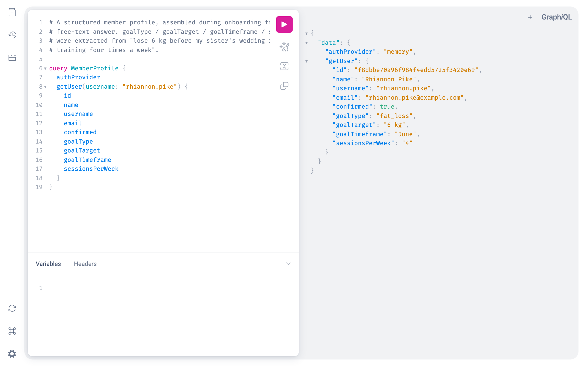
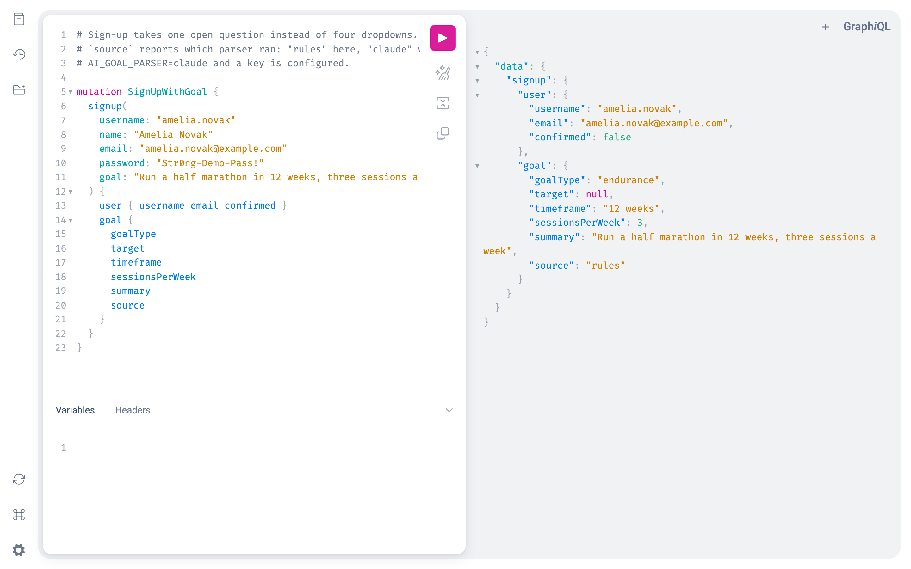
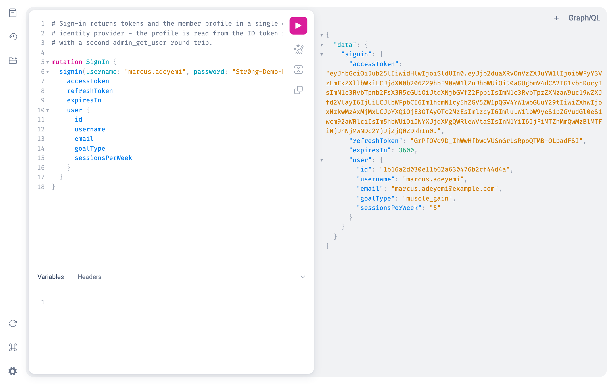
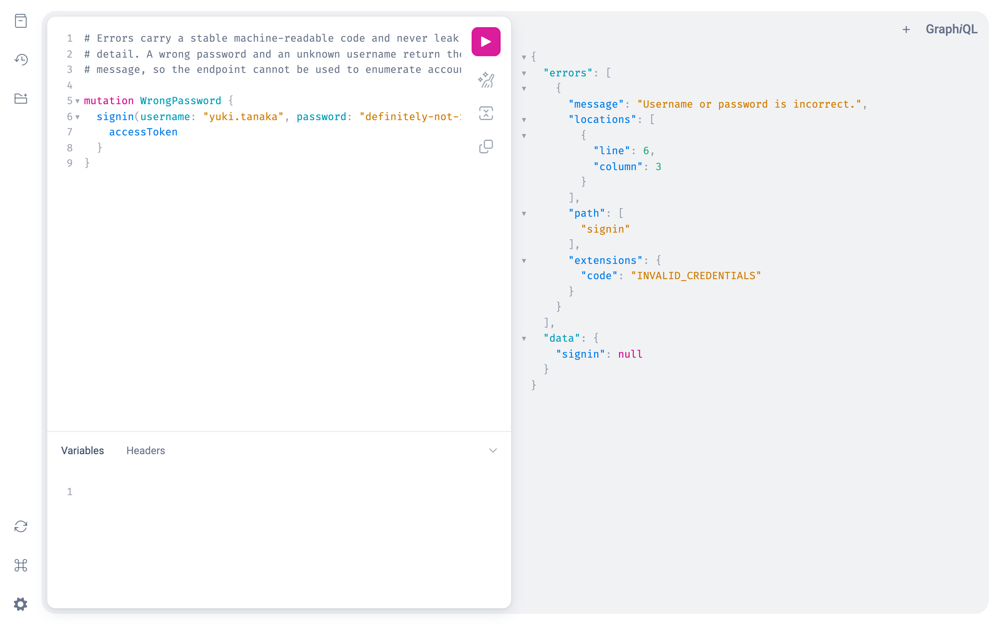
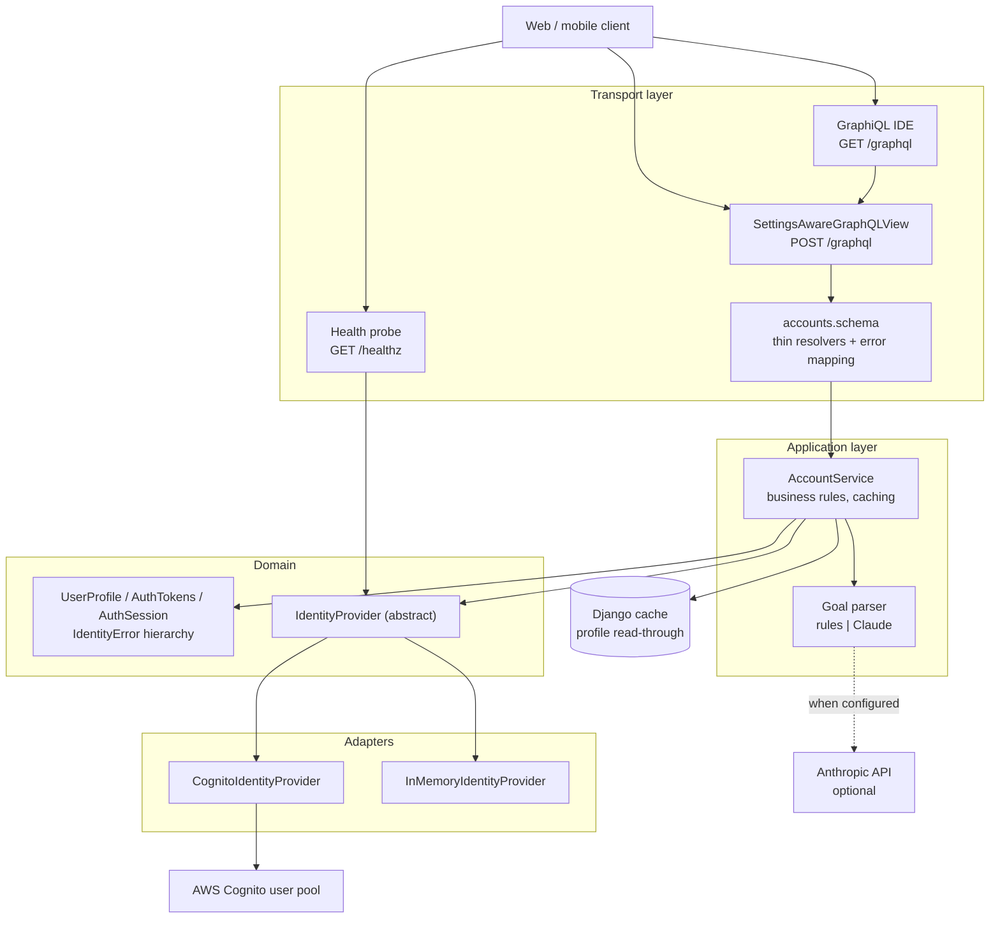
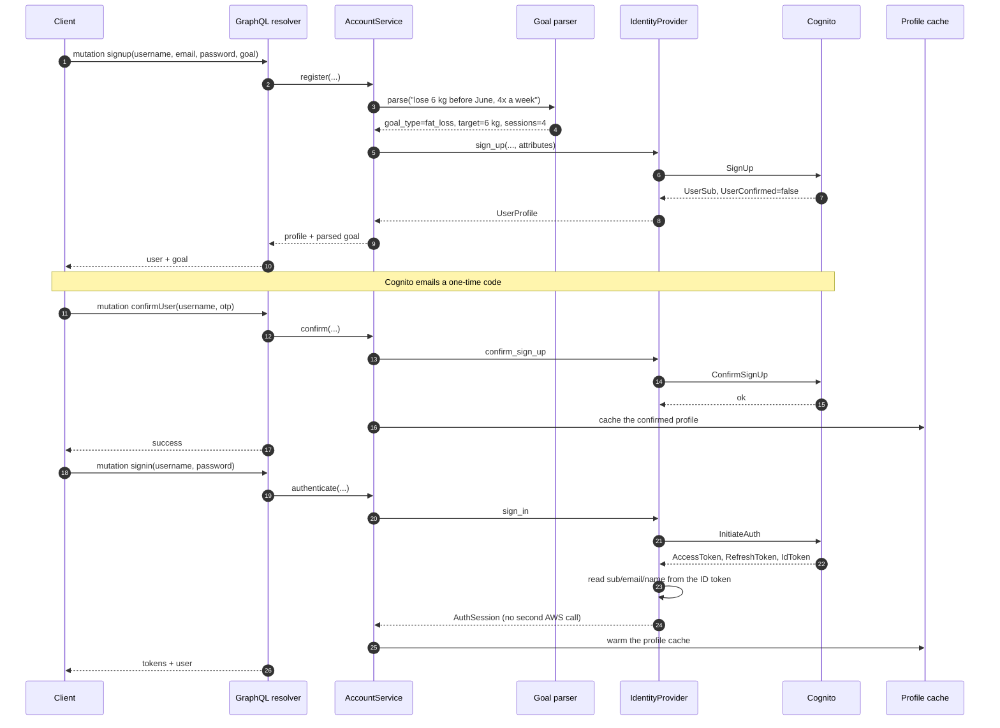

# AlterCall Fitness — Identity Service

A small Django + GraphQL service that handles sign-up, email OTP confirmation
and sign-in for the AlterCall fitness platform. It keeps no user table of its
own: accounts live in a pluggable identity provider (AWS Cognito in
production, an in-process directory for local work), and the service exposes
them through a single GraphQL endpoint. During sign-up it also turns a member's
free-text fitness goal into the structured attributes the coaching side plans
against.

## Screenshots

GraphiQL is the service's only UI — it ships with the app at `/graphql`. Every
shot below was taken against a locally running server seeded with
`manage.py seed_demo`.

| A structured member profile | Sign-up with goal parsing |
| --- | --- |
|  |  |

| Sign-in returns tokens and the profile in one provider call | Errors carry a stable code and leak nothing |
| --- | --- |
|  |  |

A plain `curl` transcript of the same flows is in
[`docs/api-transcript.txt`](docs/api-transcript.txt).

## Architecture

Ports and adapters. The GraphQL layer depends on a service, the service depends
on the `IdentityProvider` interface, and the adapters depend on the interface —
never the other way round. Nothing above `accounts/providers/` imports `boto3`.



## Sign-up and first sign-in

The flow a new member actually takes. Note that sign-in makes a single call to
the directory: the ID token returned by `InitiateAuth` already carries `sub`,
`email` and `name`, so the follow-up `AdminGetUser` was removed.



## Quickstart

Runs with no AWS account and no API keys:

```bash
python3 -m venv .venv && source .venv/bin/activate
pip install -r requirements.txt
cp .env.sample .env                    # AUTH_PROVIDER is already set to memory
python manage.py seed_demo             # optional: see the demo members
SEED_DEMO_ON_START=1 python manage.py runserver 8000
```

Open <http://localhost:8000/graphql> and run:

```graphql
query { getUser(username: "rhiannon.pike") { username email goalType goalTarget } }
```

For a real deployment set `AUTH_PROVIDER=cognito` and supply the `COGNITO_*`
values; nothing else changes.

## Configuration

| Variable | Required | Default | Purpose |
| --- | --- | --- | --- |
| `DJANGO_SECRET_KEY` | Yes when `DJANGO_DEBUG` is off | — (startup fails) | Django signing key. A dev-only fallback is used when `DJANGO_DEBUG=1`. |
| `DJANGO_DEBUG` | No | `0` | Debug mode. Also the default for `GRAPHIQL_ENABLED` and `CORS_ALLOW_ALL_ORIGINS`. |
| `DJANGO_ALLOWED_HOSTS` | No | `localhost,127.0.0.1` | Comma-separated allowed hosts. |
| `DJANGO_CSRF_TRUSTED_ORIGINS` | No | empty | Comma-separated trusted origins. |
| `DJANGO_SECURE_SSL_REDIRECT` | No | `1` when `DJANGO_DEBUG` is off | Redirect plain HTTP to HTTPS. Set to `0` behind a TLS-terminating proxy that does not forward `X-Forwarded-Proto`. |
| `DJANGO_SECURE_HSTS_SECONDS` | No | `31536000` | HSTS max-age (production only). |
| `DJANGO_DB_PATH` | No | `<repo>/db.sqlite3` | SQLite file. Django needs a database configured; this service stores nothing in it. |
| `DJANGO_CACHE_BACKEND` | No | `…locmem.LocMemCache` | Cache backend. Point at Redis/Memcached to share the profile cache across workers. |
| `DJANGO_CACHE_LOCATION` | No | `accounts-profiles` | Cache location/DSN. |
| `LOG_LEVEL` | No | `INFO` | Root log level. |
| `AUTH_PROVIDER` | No | `cognito` | `cognito` or `memory`. Selects the identity adapter. |
| `COGNITO_REGION` | Yes for `cognito` | — | AWS region of the user pool. |
| `COGNITO_USER_POOL_ID` | Yes for `cognito` | — | User pool id. |
| `COGNITO_CLIENT_ID` | Yes for `cognito` | — | App client id (must allow `USER_PASSWORD_AUTH`). |
| `COGNITO_ENDPOINT_URL` | No | — | Override the Cognito endpoint. For the benchmark harness and local test doubles only. |
| `AWS_ACCESS_KEY_ID` | No | — | Omit in production and let the instance role supply credentials. |
| `AWS_SECRET_ACCESS_KEY` | No | — | As above. |
| `PROFILE_CACHE_TTL` | No | `60` | Seconds to cache a profile. `0` disables caching. |
| `GRAPHIQL_ENABLED` | No | value of `DJANGO_DEBUG` | Serve the in-browser GraphiQL IDE. |
| `SEED_DEMO_ON_START` | No | `0` | Seed demo members at startup. Ignored unless `AUTH_PROVIDER=memory`. |
| `ENABLE_DJANGO_ADMIN` | No | `0` | Mount `/admin/`. Off by default — this service has no models to administer. |
| `CORS_ALLOW_ALL_ORIGINS` | No | value of `DJANGO_DEBUG` | Allow any browser origin. |
| `CORS_ALLOWED_ORIGINS` | No | empty | Comma-separated origin allowlist. |
| `AI_GOAL_PARSER` | No | `rules` | `rules` or `claude`. `claude` falls back to `rules` whenever a key or the SDK is missing. |
| `AI_MODEL` | No | `claude-opus-5` | Model used by the Claude goal parser. |
| `ANTHROPIC_API_KEY` | No | — | Required only for `AI_GOAL_PARSER=claude`. |

## Development

```bash
pip install -r requirements-dev.txt

python manage.py test          # 61 tests, no network access
ruff check .                   # lint
ruff format .                  # format

python docs/benchmark_signin.py --iterations 30 --latency-ms 40 --port 8551
```

`manage.py test` works on a fresh clone with no `.env`: it defaults itself to
the in-memory provider and a throwaway secret key.

Container images:

```bash
docker compose config          # validate
docker compose up --build      # serves on http://localhost:8550
```

## Project structure

```
accounts/
  domain.py                 Frozen value objects: UserProfile, AuthTokens, AuthSession
  errors.py                 IdentityError hierarchy; each carries a stable `code`
  services.py               AccountService — business rules, caching, goal attachment
  schema.py                 GraphQL types and resolvers (thin; no provider knowledge)
  views.py                  Health probe and the settings-aware GraphQL view
  providers/
    base.py                 IdentityProvider — the extension point
    cognito.py              AWS Cognito adapter; the only module importing boto3
    memory.py               In-process directory for development, demos and tests
    __init__.py             Name -> factory registry, driven by AUTH_PROVIDER
  ai/
    goals.py                RuleBasedGoalParser and ClaudeGoalParser
  management/commands/
    seed_demo.py            Realistic demo members (in-memory provider only)
  tests/                    61 tests: providers, service, AI, GraphQL, registry
fitness_tracker/
  settings.py               Typed, documented environment configuration
  urls.py                   /graphql, /graphql/, /healthz, optional /admin/
  schema.py                 Root schema, composed from the app schemas
docs/
  benchmark_signin.py       Latency/call-count harness for the sign-in path
  benchmark-output.txt      Its output, as run
  api-transcript.txt        Real curl request/response pairs
  screenshots/              The images above
```

## Design notes

**Why a provider interface.** The original code called `boto3` directly from
GraphQL resolvers, which meant the project could not run, be demoed or be
tested without a configured AWS account. The `IdentityProvider` abstraction
splits *what the platform needs from a directory* from *how Cognito provides
it*. The in-memory adapter is not a mock bolted on for tests — it is a second
real implementation of the same contract, with the same errors and the same
"unconfirmed users cannot sign in" rule, which is why the GraphQL tests
exercise the production code path end to end. Registering a third provider is a
new module plus one `register()` call.

**Errors are part of the API.** Every failure is an `IdentityError` subclass
with a stable `code`, mapped to `extensions.code` on the GraphQL error. Two
consequences: clients can branch on failures without string-matching, and
Cognito's own wording never reaches a user — the previous code returned
`str(ClientError)`, which distinguished "no such user" from "wrong password"
and included the pool id and AWS request id.

**The bottleneck was AWS round trips, not Python.** Two measured problems, both
on the hottest paths:

1. `signin` called `InitiateAuth` *and* `AdminGetUser`. The ID token returned
   by the first call already contains `sub`, `email`, `name` and the custom
   attributes, so the second call bought nothing but latency and admin-API
   quota. It now reads the claims from the token it was just handed over TLS,
   falling back to a lookup only if the token is unusable.
2. `getUser` hit Cognito on every request. Profiles are read far more often
   than they change, so reads now go through a TTL cache (`PROFILE_CACHE_TTL`,
   default 60s), and a successful sign-in warms it — an immediate `getUser`
   after signing in costs nothing.

Measured with `docs/benchmark_signin.py`, which points boto3 at a local stub
speaking the Cognito wire protocol with 40 ms injected per call. Real boto3
serialisation, signing, HTTP and parsing; only the AWS network hop is
simulated, and the 40 ms figure is a stand-in rather than a measurement of
production Cognito:

```
path                                calls/op   median ms   mean ms
------------------------------------------------------------------
signin (legacy, 2 AWS calls)             2.0       105.6     107.2
signin (current, 1 AWS call)             1.0        53.5      52.1
getUser (cache off)                      1.0        54.8      53.9
getUser (cache on, warm)                 0.0         0.0       0.0
```

The call counts are exact and provider-independent; the times scale with
whatever real Cognito latency is. In-process cache hits are the default because
this service runs behind a small fleet; point `DJANGO_CACHE_BACKEND` at Redis
to share the cache across workers.

**One open question instead of four dropdowns.** Sign-up accepts a free-text
`goal` and stores the structured result as provider attributes. The default
parser is deterministic keyword/regex extraction with no dependencies; setting
`AI_GOAL_PARSER=claude` swaps in a Claude-backed parser that handles phrasing
the rules miss. The fallback is the contract, not decoration: a missing key, a
missing SDK, a rate limit, a network failure or a non-JSON reply all degrade to
the rule-based result rather than failing a registration. `goal.source` tells
the client which parser actually ran, so the UI can only claim "AI-assisted"
when it was. No test makes a real API call.

**Stateless by construction.** There is no user model, no migration and no
session. `django.contrib.admin` and its middleware stack are not installed
unless `ENABLE_DJANGO_ADMIN=1`, because an admin site with nothing to
administer is only an attack surface.

## Limitations

- **No token verification.** The service issues Cognito tokens but does not yet
  verify one presented by a client. `_decode_jwt_claims` reads an ID token that
  Cognito returned over TLS in the same response and is deliberately *not*
  signature-verifying; a token arriving from a client must be checked against
  the pool's JWKS first. There is no authorization layer and no protected
  resolver.
- **Custom attributes must exist in the pool.** Goal attributes are written as
  `custom:goal_type` and friends. Cognito rejects custom attributes that are not
  declared in the pool schema, so they must be added at pool-creation time —
  they cannot be added to an existing pool later.
- **No refresh, sign-out, password reset or MFA.** `RefreshToken` is returned
  but there is no mutation that exchanges it, and there is no
  `ForgotPassword`/`GlobalSignOut` equivalent.
- **No rate limiting.** `signin` and `confirmUser` are unthrottled at this
  layer; Cognito's own limits are the only protection against credential
  stuffing. A per-IP throttle belongs in front of this service.
- **Cache invalidation is time-based.** A profile changed directly in Cognito
  is visible here only after `PROFILE_CACHE_TTL` expires.
- **The in-memory provider is not a production backend.** It is process-local,
  forgets everything on restart, and its "OTP" is the fixed string `123456`.
- **Docker images are unbuilt.** The `Dockerfile` and `docker-compose.yml` pass
  `docker compose config` but have not been built or booted in this environment.
- **The suite has no load or concurrency tests**, and the benchmark's AWS
  latency is simulated rather than measured against a real user pool.
